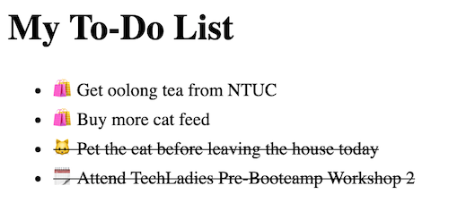

# Lesson 4 - Adding Artificial Intelligence (control structure, flow controls, if... else, switch)

In this lesson, we will be switching back to using Visual Studio Code and editing in the HTML file.

## Exercise 4.1

**Scenario:** My software speaks to me

**Objective:**

- Learn about controling the flow of your app
- Use controls to alter the inner workings of your software

**Steps:**

1. Create a new file and name it `lesson4.html`
2. Copy and paste this into your HTML file:

    ```html
    <!doctype html>
    <html lang="en">
      <head>
        <meta charset="utf-8">
        <title>Lesson 4</title>
        <style>
          .done {
            text-decoration: line-through;
          }
        </style>
      </head>
      <body>
        <h1>My To-Do List</h1>
    
        <ul id="myList"></ul>
    
        <script>
          // Some comments here
    
          /*
          Some multi-line comments here
          Handy for making some interesting comments
          */
    
          // Initializing the To Do List array
          let myToDo = []
    
          // Adding some to-do list items
          myToDo.push({ name: 'Get oolong tea from NTUC', done: false, type: 'shopping' })
          myToDo.push({ name: 'Buy more cat feed', done: false, type: 'shopping' })
          myToDo.push({ name: 'Pet the cat before leaving the house today', done: true, type: 'pet' })
          myToDo.push({ name: 'Attend TechLadies Pre-Bootcamp Workshop 2', done: true, type: 'event' })
    
          const myListElement = document.getElementById('myList')
    
          for(let i=0; i < myToDo.length; i++) {
            const currentItem = myToDo[i]
    
            let emoji
            switch (currentItem.type) {
              case 'shopping':
                emoji = '🛍'
                break
              case 'event':
                emoji = '🗓'
                break
              case 'pet':
                emoji = '🐱'
                break
              default:
                emoji = '📝'
                break
            }
    
            const newListElement = document.createElement("li")
            if (currentItem.done) {
              newListElement.className = 'done'
            }
    
            newListElement.innerText = emoji + '' + currentItem.name
    
            myListElement.appendChild(newListElement)
          }
        </script>
      </body>
    </html>
    ```

3. Now open the page in your browser.

    It should look something like this:
    
    

### Explanation

Let's explore the different parts:

- Line 36: We initialized the `myToDo` variable as an empty Array.
- Line 29-32: We added a bunch of To Do List items into the `myToDo` Array
- Line 34: We added a reference to the `myList` unordered list HTML DOM element
- Line 36: We created a `for` loop to go through every item inside the `myToDo` Array
- Line 37-62: Create and populate the To Do List items into the unordered list `myList`

Let's look at the new JavaScript concepts introduced here:

1. if... else... statement
2. For loop statement
3. Switch case statement

These same things exists in all programming languages.

Additionally, we used some new HTML DOM manipulation methods:

- `document.createElement("li")`
- `newListElement.className = 'done'`
- `newListElement.innerText = emoji + '' + currentItem.name`
- `myListElement.appendChild(newListElement)`

Together, these are the basic building blocks used in creating a JavaScript front-end web app.

---

[Next: Lesson 5 - How to not repeat yourself ≫](lesson2.md)
