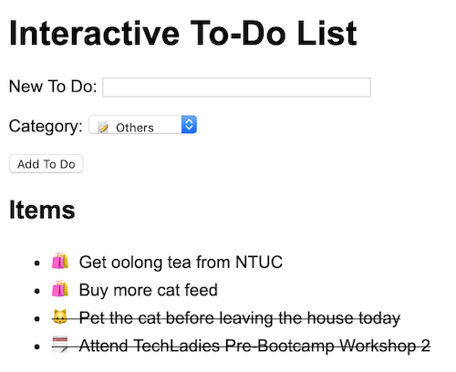

# Lesson 5 - How to not repeat yourself (functions, linking JS files)

## Exercise 5.1

**Scenario:** Trying to DRY all the things

**Objective:**

- Learn about how group commonly used JavaScript statements and commands into functions
- Learn how to link external JavaScript files

**Steps:**

1. Create a new file: `lesson5.html`

2. Copy and paste this as its content:

    ```html
    <!doctype html>
    <html lang="en">
      <head>
        <meta charset="utf-8">
        <title>Lesson 5</title>
        <style>
          body {
            font-family: Arial, Helvetica, sans-serif;
          }
          .done {
            text-decoration: line-through;
          }
          a {
            cursor: pointer;
          }
        </style>
        <script src="lesson5.js"></script>
      </head>
      <body>
        <h1>Interactive To-Do List</h1>

        <form id="todoForm">
          <p>
            <label for="todoTextField">New To Do:</label>
            <input type="text" id="todoTextField" size="40" />
          </p>
          <p>
            <label for="todoCategoryField">Category:</label>
            <select id="todoCategoryField">
              <option value="shopping">🛍 Shopping</option>
              <option value="event">🗓 Event</option>
              <option value="pet">🐱 Pet</option>
              <option value="others" selected>📝 Others</option>
            </select>
          </p>
          <p>
            <button>Add To Do</button>
          </p>
        </form>

        <h2>Items</h2>
        <ul id="myList"></ul>
      </body>
    </html>
    ```

3. Create a new file called: `lesson5.js`

4. Copy and paste this as its content:

    ```javascript
    // Initializing the To Do List array
    let myToDo = []
    
    // Adding some to-do list items
    myToDo.push({ name: 'Get oolong tea from NTUC', done: false, type: 'shopping' })
    myToDo.push({ name: 'Buy more cat feed', done: false, type: 'shopping' })
    myToDo.push({ name: 'Pet the cat before leaving the house today', done: true, type: 'pet' })
    myToDo.push({ name: 'Attend TechLadies Pre-Bootcamp Workshop 2', done: true, type: 'event' })
    
    function displayToDos() {
      const myListElement = document.getElementById('myList')
    
      while (myListElement.firstChild) {
        myListElement.removeChild(myListElement.firstChild);
      }
    
      for(let i=0; i < myToDo.length; i++) {
        const currentItem = myToDo[i]
    
        let emoji
        switch (currentItem.type) {
          case 'shopping':
            emoji = '🛍'
            break
          case 'event':
            emoji = '🗓'
            break
          case 'pet':
            emoji = '🐱'
            break
          default:
            emoji = '📝'
            break
        }
    
        const newListElement = document.createElement("li")
        if (currentItem.done) {
          newListElement.className = 'done'
        }
    
        newListElement.innerText = emoji + ' ' + currentItem.name
    
        myListElement.appendChild(newListElement)
      }
    }
    
    function resetForm() {
      document.getElementById('todoTextField').value = ''
      document.getElementById('todoCategoryField').value = 'others'
    }
    
    function addNewTodo(todoTextStr, categoryStr) {
      if (todoTextStr.length == 0) { return false }
    
      if (todoTextStr.length > 0) {
        let newToDo = { name: todoTextStr, done: false, type: categoryStr }
        myToDo.push(newToDo)
      }
    
      return true
    }
    
    document.addEventListener("DOMContentLoaded", function(event) {
      displayToDos()
    
      const todoForm = document.getElementById("todoForm")
      todoForm.addEventListener('submit', function (event) {
        event.preventDefault()
    
        let todoText = document.getElementById('todoTextField').value
        let todoCategory = document.getElementById('todoCategoryField').value
    
        if (addNewTodo(todoText, todoCategory)) {
          displayToDos()
        }
    
        resetForm()
      })
    })
    ```
5. Open `lesson5.html` in your Chrome browser
6. Try to add new To Do List items.

    

7. Try to add a few To Do items to the list by using the form.

### Explanation

1. So you have just created a HTML file and linked to an external JavaScript file (line 17). You can link more than 1 file. You can also put the `<link>` tag outside the `<head>` tag.

2. You find that in the JavaScript file, several JavaScript statments that work together to do something can be grouped together. We call these groups "functions" - together they do something and return the result of that something. All functions must return something (usually at the end of the function) - functions that don't have an explicit `return` statement will just be returning `null`.

    *Can you guess what these functions do?*

    - Line 10: `function displayToDos()`
    - Line 47: `function resetForm()`
    - Line 52: `function addNewTodo(todoTextStr, categoryStr)`
    - Line 63: `document.addEventListener("DOMContentLoaded", function(event) { ...`

    Notice that the function in **Line 63** does not have a name - this is called an "anonymous function" (a function with no name).

---

## Exercise 5.2

**Scenario:** Let's mark the To Do as done

**Objective:**

- Add new functionality by adding HTML and JavaScript

**Steps:**

1. Replace the `displayToDos()` function with this:

    ```javascript
    function displayToDos() {
      const myListElement = document.getElementById('myList')
    
      while (myListElement.firstChild) {
        myListElement.removeChild(myListElement.firstChild);
      }
    
      for(let i=0; i < myToDo.length; i++) {
        const currentItem = myToDo[i]
    
        let emoji
        switch (currentItem.type) {
          case 'shopping':
            emoji = '🛍'
            break
          case 'event':
            emoji = '🗓'
            break
          case 'pet':
            emoji = '🐱'
            break
          default:
            emoji = '📝'
            break
        }
    
        const nameLinkElement = document.createElement("a")
    
        nameLinkElement.dataset.itemSeq = i
        nameLinkElement.innerText = emoji + ' ' + currentItem.name
        if (currentItem.done) {
          nameLinkElement.className = 'done'
        }
    
        nameLinkElement.addEventListener('click', function(e) {
          toggleToDo(e.target.dataset.itemSeq)
          displayToDos()
        })
    
        const newListElement = document.createElement("li")
        newListElement.appendChild(nameLinkElement)
    
        myListElement.appendChild(newListElement)
      }
    }
    ```
    
    The main difference is what we replaced from line 36 onwards.
    
2. Add this new function to the end of the file:

    ```javascript
    function toggleToDo(itemSeq) {
      myToDo[itemSeq].done = !myToDo[itemSeq].done
    }
    ```

3. Reload the HTML file and try clicking on the items.

### Explanation

1. We modified the `displayToDos()` function to add a hyperlink to each item and also to make them clickable.

2. We added a new function to toggle the `done` attribute for the row in the `myToDo` array.

3. The `displayToDos()` function is getting quite big. Can you think of how we can move certain lines into another function group?

---

[Next: Part 2 - Using JS in the Command Line ≫](../part2/README.md)
